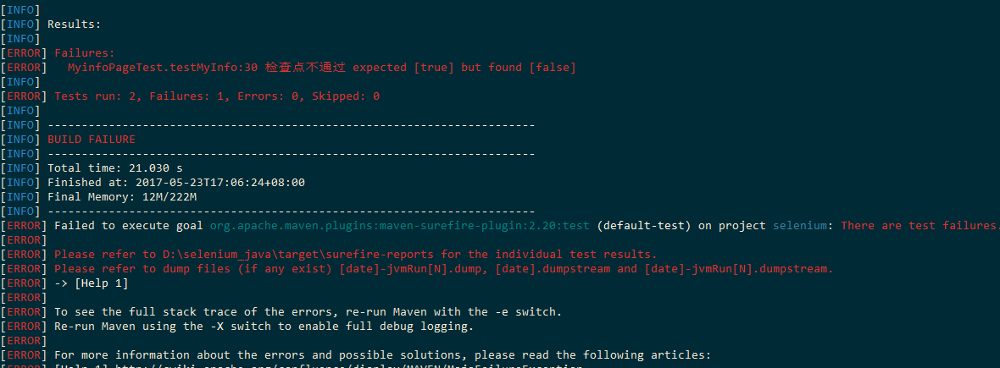

# selenium3 java
* window7_X64 
* maven 
* testng 
* write testCase use yaml
* PageObject 
* docker 

# config

- config [pom.xml](pom.xml)
- config [testng](res/testng.xml)
- config [log4j](res/log4j.properties)
- exec ```docker-compose up```

# Example

- login testcase 

**PageObject**

All page are made up of three parts:

* constructor
* operation method
* checkPoint

```
public class LoginPage {
    YamlRead yamlRead;
    OperateElement operateElement;
    protected WebDriver driver;
    private boolean isOperate = true;
    /***
     * 
     * @param driver
     * @param path yaml
     */
    public LoginPage(WebDriver driver, String path) {
        this.driver = driver;
        yamlRead = new YamlRead(path);
        operateElement= new OperateElement(this.driver);
    }

    /***
     * operate setp
     * @throws YamlException
     * @throws FileNotFoundException
     */
    public void operate() throws YamlException, FileNotFoundException, InterruptedException {
        List list = (List) yamlRead.getYmal().get("testcase");
//        System.out.println(list);
        for(Object item: list){
            TestCase testCase = new TestCase();
            testCase.setFind_type((String) ((Map)item).get("find_type"));
            testCase.setElement_info((String) ((Map)item).get("element_info"));
            testCase.setText((String) ((Map)item).get("text"));
            testCase.setOperate_type((String) ((Map)item).get("operate_type"));
            if (!operateElement.operate(testCase)) {
                isOperate = false;
                System.out.println("operate failed");
                break;
            }

        }
    }

    /***
     * checkPoint
     * @return
     * @throws YamlException
     * @throws FileNotFoundException
     */
    public boolean checkpoint() throws YamlException, FileNotFoundException, InterruptedException {
        if (!isOperate) { // If the operation step fails, the checkpoint fails
            System.out.println("operate failed");
            return false;
        }
        List list = (List) yamlRead.getYmal().get("check");
        for(Object item: list){
                CheckPoint checkPoint = new CheckPoint();
                checkPoint.setElement_info((String) ((Map)item).get("element_info"));
                checkPoint.setFind_type((String) ((Map)item).get("find_type"));
                if (!operateElement.checkElement(checkPoint)) {
                    return false;
                }
            }

        return true;
    }
	
```

**login yaml**

```
testcase:
    - element_info: user_login
      find_type: id
      operate_type: send_keys
      text: lose
    - element_info: user[password]
      find_type: name
      operate_type: send_keys
      text: password
    - element_info: //*[@id="new_user"]/div[4]/input
      find_type: xpath
      operate_type: click
check:
    - element_info: /html/body/div[1]/nav/div/ul[1]/li/a/img
      find_type: xpath
    - element_info: /html/body/div[1]/nav/div/ul[2]/li[2]/a
      find_type: xpath

```


**login test**

```
public class LoginTest  {
    private WebDriver driver;
    private TestBaseSetup testBaseSetup = new TestBaseSetup();


    @Parameters({ "browserType", "appURL" ,"driverPath","browserVersion", "remoteIP"})
    @BeforeClass
    public void setUp(String browserType, String appURL, String driverPath, String browserVersion, String remoteIP) {
        driver = testBaseSetup.setDriver(browserType, appURL, driverPath,browserVersion, remoteIP);
    }

    @Test
    public void testLogin() throws YamlException, FileNotFoundException, InterruptedException {
        LoginPage loginPage = new LoginPage(this.driver, "/Login.yaml");
        loginPage.operate();
        Assert.assertTrue(loginPage.checkpoint(), "checkPoint is failed");

    }

    @AfterClass
    public void tearDown() {

        this.driver.quit();
    }
}
```


# execute

``` mvn test```




**report**


# other
* [Chinese](chinese.md)


