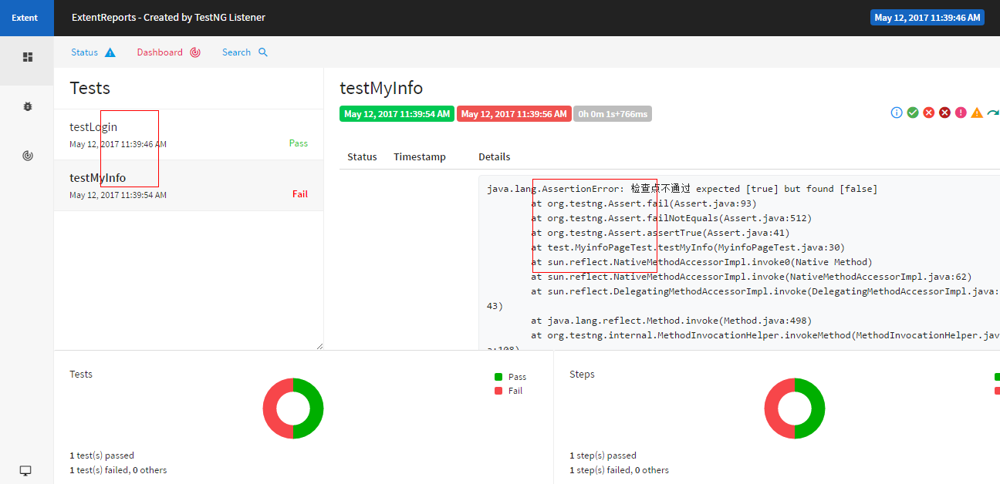

# 2017-5-10 更新历史
* 第一个版本
* maven 管理
* testng 配置测试类
* yaml维护用例
* PageObject 模式

# 2017-5-12 更新历史
* 更新了测试报告使用[extentreports](http://extentreports.com/)

# 2017-5-15 更新历史
* 更新log4j记录日志

# 2017-5-15 更新历史
* 更新得到了元素却不可操作问题，加了个800毫秒延时

**测试结果**

# 其他
查看我的[更新日志](chanelog.md)