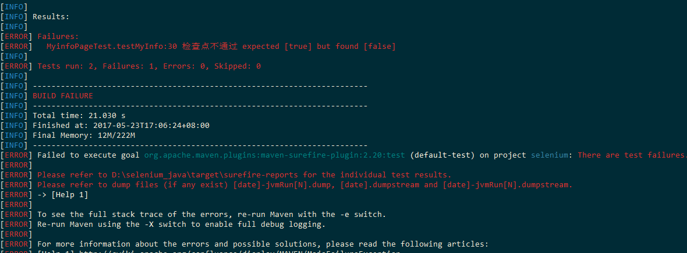
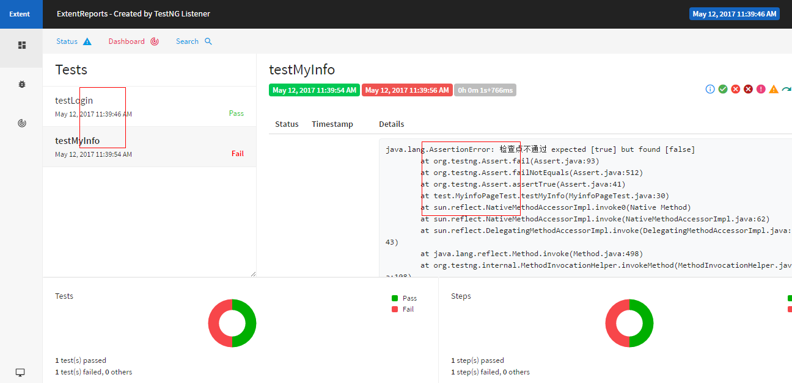

# 说明

selenium3+java+windows7_64

# 功能
* maven 管理
* testng 配置测试类
* yaml维护用例
* PageObject 模式
* docker 多浏览器支持


# 配置

- 配置 [pom.xml](pom.xml)
- 配置 [testng](res/testng.xml)
- 配置 [log4j](res/log4j.properties)
- 执行 ```docker-compose up```

# 实例

**配置PageObject**

以登录为例子,所有的page都由三部分构成：

* 构造函数
* 操作方法
* 检查点

```
public class LoginPage {
    YamlRead yamlRead;
    OperateElement operateElement;
    protected WebDriver driver;
    private boolean isOperate = true;
    /***
     * 默认构造函数
     * @param driver
     * @param path yaml配置参数
     */
    public LoginPage(WebDriver driver, String path) {
        this.driver = driver;
        yamlRead = new YamlRead(path);
        operateElement= new OperateElement(this.driver);
    }

    /***
     * 测试步骤
     * @throws YamlException
     * @throws FileNotFoundException
     */
    public void operate() throws YamlException, FileNotFoundException, InterruptedException {
        List list = (List) yamlRead.getYmal().get("testcase");
//        System.out.println(list);
        for(Object item: list){
            TestCase testCase = new TestCase();
            testCase.setFind_type((String) ((Map)item).get("find_type"));
            testCase.setElement_info((String) ((Map)item).get("element_info"));
            testCase.setText((String) ((Map)item).get("text"));
            testCase.setOperate_type((String) ((Map)item).get("operate_type"));
            if (!operateElement.operate(testCase)) {
                isOperate = false;
                System.out.println("操作失败");
                break;
            }

        }
    }

    /***
     * 检查点
     * @return
     * @throws YamlException
     * @throws FileNotFoundException
     */
    public boolean checkpoint() throws YamlException, FileNotFoundException, InterruptedException {
        if (!isOperate) { // 如果操作步骤失败，检查点也就判断失败
            System.out.println("操作步骤失败了");
            return false;
        }
        List list = (List) yamlRead.getYmal().get("check");
        for(Object item: list){
                CheckPoint checkPoint = new CheckPoint();
                checkPoint.setElement_info((String) ((Map)item).get("element_info"));
                checkPoint.setFind_type((String) ((Map)item).get("find_type"));
                if (!operateElement.checkElement(checkPoint)) {
                    return false;
                }
            }

        return true;
    }
	
```

**配置登录的yaml**

```
testcase:
    - element_info: user_login
      find_type: id
      operate_type: send_keys
      text: lose
    - element_info: user[password]
      find_type: name
      operate_type: send_keys
      text: password
    - element_info: //*[@id="new_user"]/div[4]/input
      find_type: xpath
      operate_type: click
check:
    - element_info: /html/body/div[1]/nav/div/ul[1]/li/a/img
      find_type: xpath
    - element_info: /html/body/div[1]/nav/div/ul[2]/li[2]/a
      find_type: xpath

```


**登录测试**

```
public class LoginTest  {
    private WebDriver driver;
    private TestBaseSetup testBaseSetup = new TestBaseSetup();


    @Parameters({ "browserType", "appURL" ,"driverPath","browserVersion", "remoteIP"})
    @BeforeClass
    public void setUp(String browserType, String appURL, String driverPath, String browserVersion, String remoteIP) {
        driver = testBaseSetup.setDriver(browserType, appURL, driverPath,browserVersion, remoteIP);
    }

    @Test
    public void testLogin() throws YamlException, FileNotFoundException, InterruptedException {
        LoginPage loginPage = new LoginPage(this.driver, "/Login.yaml");
        loginPage.operate();
        Assert.assertTrue(loginPage.checkpoint(), "checkPoint is failed");

    }

    @AfterClass
    public void tearDown() {

        this.driver.quit();
    }
}
```

# 命令执行

``` mvn test```




**测试结果**



# 其他

查看我的[更新日志](chanelog.md)


